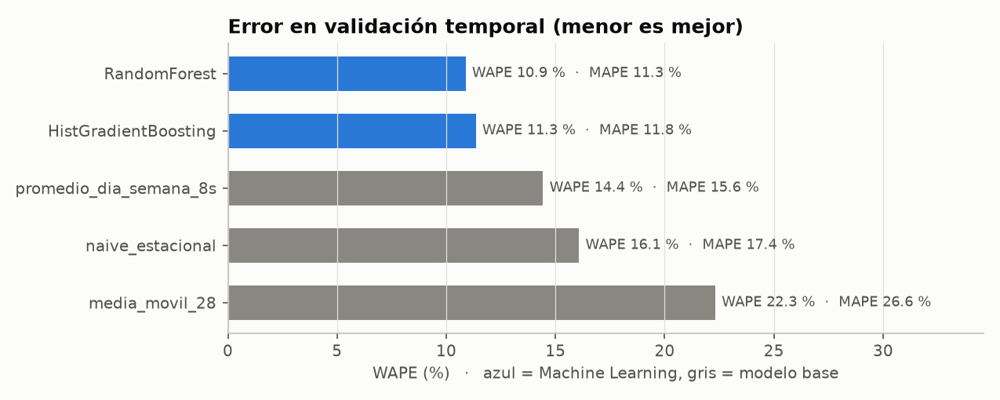
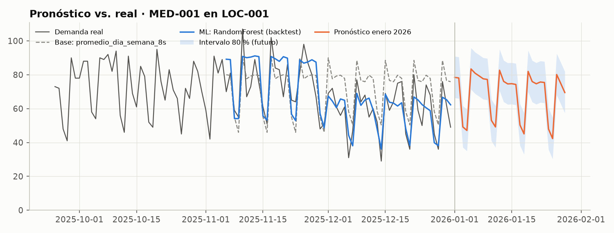
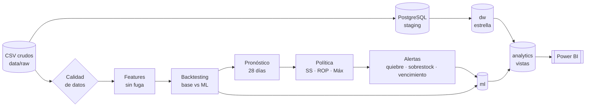

# HealthSupply AI — Analítica predictiva para inventarios en salud

**Python · SQL (PostgreSQL) · Power BI · scikit-learn**

Proyecto completo de ciencia de datos aplicado a la cadena de abastecimiento de una red de salud
(1 hospital, 2 clínicas y 2 centros médicos; 15 insumos médicos; 2023-2025). Va del dato crudo a
la decisión: calidad de datos → modelo dimensional → pronóstico de demanda → política de
inventario → alertas → tablero.

- **Pronóstico de demanda** por producto y sede con **validación temporal** (backtesting de 4 ventanas) y métricas **MAE/MAPE/WAPE**, comparando 3 modelos base contra 2 de Machine Learning.
- **Stock de seguridad y punto de reorden** por clase ABC, con **alertas** de quiebre, sobrestock y vencimiento (simulación FEFO).
- **Modelo dimensional en PostgreSQL** (esquema estrella) con **validaciones de calidad de datos** y **diccionario de datos**.
- **Tablero en Power BI** de cobertura, rotación, riesgo de vencimiento y precisión del pronóstico.

> Cada paso está documentado para **aprender** el porqué, no solo el cómo. Ruta de lectura sugerida al final.

---

## Resultados principales

| | Resultado |
|---|---|
| Calidad de datos | 46 reglas en Python y 34 en SQL · **0 errores**, 2 advertencias explicadas (quiebres de 2023 y lotes vencidos) |
| Mejor modelo | **RandomForest** (modelo global para las 75 series) |
| Precisión diaria | **WAPE 10,9 %** · MAPE 11,3 % · MAE 2,5 u/día · sesgo +0,8 % |
| Precisión semanal | **WAPE 5,5 %** |
| vs. mejor modelo base | **−24,6 % de error** (WAPE 14,4 % → 10,9 %); la ventaja es máxima en diciembre, cuando los baselines fallan |
| Situación al 31-dic-2025 | **75/75 combinaciones en sobrestock**: 100-165 días de cobertura vs. ~46 recomendados → **$193 millones COP** sobre el stock máximo |
| Vencimientos | **71 lotes vencidos** ($103 millones) + 4 lotes en riesgo de vencer sin consumirse |
| Hallazgo de negocio | La red pasó de **46 días de quiebre (2023)** a **129 días de inventario (2025)**: sobrecorrección sin política cuantitativa |

<p align="center">
  
</p>
<p align="center">
  
</p>
<p align="center">
  
</p>

---

## Arquitectura



## Estructura del repositorio

```
healthsupply-ai/
├── data/
│   ├── raw/                 # 8 CSV sintéticos de entrada (dimensiones y hechos)
│   └── processed/           # salidas del pipeline: pronósticos, métricas, política, alertas, DQ
├── src/healthsupply/        # paquete de Python (código reutilizable y comentado)
│   ├── config.py            # supuestos de negocio centralizados
│   ├── data_loading.py      # carga tipada de los CSV
│   ├── data_quality.py      # 46 reglas de calidad de datos
│   ├── kpis.py              # rotación, cobertura, fill rate
│   ├── forecasting.py       # features, baselines, ML, backtesting, pronóstico final
│   ├── metrics.py           # MAE, MAPE, WAPE, sesgo, RMSE
│   ├── inventory_policy.py  # ABC, stock de seguridad, punto de reorden, stock máximo
│   ├── alerts.py            # simulación FEFO y centro de alertas
│   └── figures.py           # gráficos del reporte
├── scripts/
│   ├── run_pipeline.py      # ejecuta todo el flujo de Python de punta a punta
│   ├── cargar_postgres.sh   # carga staging → dw → dq → ml → analytics
│   └── exportar_powerbi.py  # tablas para Power BI sin PostgreSQL (modo CSV)
├── sql/                     # 01 staging · 02 carga · 03 modelo estrella · 04 ETL · 05 calidad
│                            # 06 resultados ML · 07 vistas Power BI · 08 consultas de práctica
├── notebooks/               # 01 EDA y calidad · 02 pronóstico · 03 política y alertas (ejecutados)
├── powerbi/                 # medidas DAX y tema de colores
├── docs/                    # documentación paso a paso (ver ruta de aprendizaje)
├── reports/figures/         # gráficos generados
└── tests/                   # pruebas unitarias (pytest)
```

## Cómo ejecutarlo

```bash
cd healthsupply-ai
python -m venv .venv && source .venv/bin/activate      # Windows: .venv\Scripts\activate
pip install -r requirements.txt

python scripts/run_pipeline.py      # ~2 min: calidad → backtesting → pronóstico → política → alertas
pytest -q                           # 10 pruebas
bash scripts/cargar_postgres.sh     # opcional: modelo dimensional en PostgreSQL
python scripts/exportar_powerbi.py  # opcional: tablas para Power BI sin PostgreSQL
```

Guía detallada (Windows/macOS/Linux, pgAdmin, errores comunes): [docs/08_guia_ejecucion.md](docs/08_guia_ejecucion.md).

## Ruta de aprendizaje

| # | Documento | Qué aprendes |
|---|---|---|
| 1 | [Contexto y objetivos](docs/01_contexto_y_objetivos.md) | Problema de negocio, preguntas, KPIs y supuestos |
| 2 | [Datos y calidad](docs/02_datos_y_calidad.md) · [notebook 01](notebooks/01_exploracion_y_calidad.ipynb) | Dimensiones de calidad de datos, EDA y cómo cada hallazgo guía el modelo |
| 3 | [Modelo dimensional](docs/03_modelo_dimensional.md) · [sql/](sql/) | Esquema estrella, grano, llaves sustitutas, capas staging/dw/analytics |
| 4 | [Diccionario de datos](docs/04_diccionario_datos.md) | Cada tabla y columna, de origen a resultado |
| 5 | [Pronóstico de demanda](docs/05_pronostico_demanda.md) · [notebook 02](notebooks/02_pronostico_demanda.ipynb) | Baselines, features sin fuga, backtesting, MAE/MAPE/WAPE, importancia de variables |
| 6 | [Política de inventario](docs/06_politica_inventario.md) · [notebook 03](notebooks/03_politica_inventario_y_alertas.ipynb) | ABC, stock de seguridad, ROP, stock máximo, FEFO, alertas (con ejemplo resuelto) |
| 7 | [Tablero Power BI](docs/07_tablero_power_bi.md) · [DAX](powerbi/medidas_dax.md) | Modelo semántico, medidas semiaditivas, diseño de 7 páginas |
| 8 | [Guía de ejecución](docs/08_guia_ejecucion.md) | Instalación y ejecución paso a paso |
| 9 | [Roadmap PySpark y LLM](docs/09_roadmap_pyspark_llm.md) | Cómo escalar y cómo integrar un LLM con salvaguardas |
| 10 | [Glosario](docs/10_glosario.md) | Términos de inventarios, pronóstico y modelado |

## Decisiones técnicas clave

- **Validación temporal, no aleatoria**: 4 ventanas de 28 días con origen móvil; nunca se entrena con el futuro.
- **Rezagos ≥ horizonte** (28 días): un solo modelo pronostica los 28 días sin fuga de información (verificado con una prueba unitaria).
- **Modelo global** para las 75 series: más datos por modelo y un solo artefacto que mantener.
- **WAPE como métrica de selección**: pondera por volumen y es robusta en días de baja demanda (MAPE se reporta, pero no decide).
- **Stock de seguridad con el σ del error del pronóstico** (no el de la demanda) y la variabilidad real del lead time.
- **Alertas de vencimiento por simulación FEFO**, no solo por fecha: separa lotes que rotan a tiempo de los que se perderán.
- **Reglas de calidad duplicadas en Python y SQL** + restricciones `CHECK/FK` en el DW: el pipeline se detiene ante un `ERROR`.

## Limitaciones

Datos **sintéticos** (cifras ilustrativas); sin variables externas (festivos, epidemiología, agenda quirúrgica);
la demanda en días de quiebre se asume registrada completa. Ver secciones de limitaciones en
[docs/05](docs/05_pronostico_demanda.md#8-limitaciones-y-mejoras-posibles) y el [roadmap](docs/09_roadmap_pyspark_llm.md).
