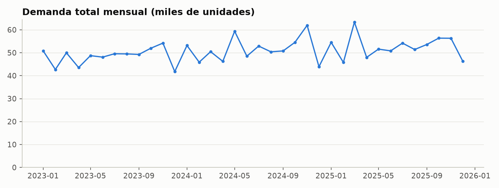
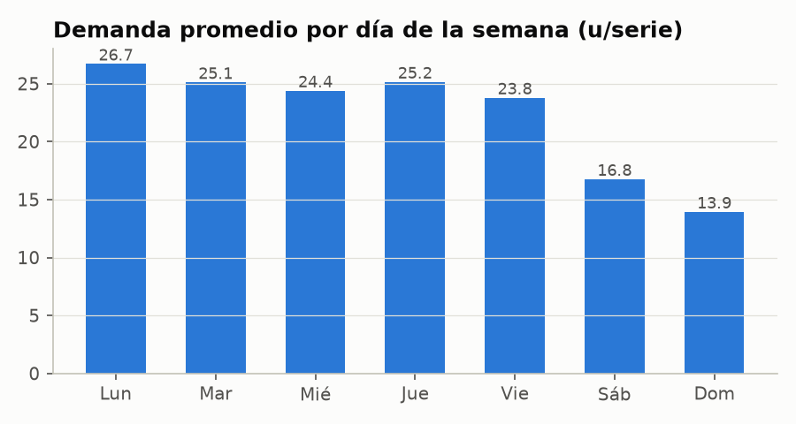

# 02 · Datos, exploración y calidad de datos

Notebook asociado: [`notebooks/01_exploracion_y_calidad.ipynb`](../notebooks/01_exploracion_y_calidad.ipynb)

## 1. Las 8 tablas del dataset

| Tabla | Tipo | Filas | Grano (qué representa 1 fila) |
|---|---|---:|---|
| `dim_fecha` | Dimensión | 1.096 | 1 día (2023-01-01 a 2025-12-31) |
| `dim_producto` | Dimensión | 15 | 1 insumo médico |
| `dim_proveedor` | Dimensión | 5 | 1 proveedor |
| `dim_ubicacion` | Dimensión | 5 | 1 sede |
| `fact_demanda` | Hecho | 82.200 | 1 día × 1 producto × 1 sede |
| `fact_inventario` | Hecho | 82.200 | 1 día × 1 producto × 1 sede |
| `fact_compras` | Hecho | 3.000 | 1 orden de compra |
| `fact_lotes` | Hecho (foto) | 225 | 1 lote con su fecha de vencimiento |

82.200 = 1.096 días × 15 productos × 5 sedes: el panel está **completo**.
El detalle de cada columna está en el [diccionario de datos](04_diccionario_datos.md).

## 2. Validaciones de calidad de datos

### ¿Por qué validar antes de modelar?
Si hay duplicados, el modelo "ve" demanda doble. Si una llave foránea no existe, el tablero
pierde filas en silencio. Si el balance del inventario no cuadra, los KPIs de cobertura mienten.
La calidad se valida **primero** y se deja **evidencia** (un reporte), no solo "lo revisé".

### Dimensiones de calidad usadas

| Dimensión | Pregunta | Ejemplos de reglas en este proyecto |
|---|---|---|
| **Completitud** | ¿Falta algo? | Sin nulos; panel fecha×producto×sede completo; calendario sin huecos; filas staging = filas DW |
| **Unicidad** | ¿Hay repetidos? | Llave (fecha, producto, sede) única; `lote_id` único |
| **Validez** | ¿Está en el dominio permitido? | Cantidades ≥ 0; fechas dentro del calendario; atípicos por IQR |
| **Consistencia** | ¿Se cumplen las reglas de negocio? | `inicial + entradas − salidas = final`; `disponible = final − reservado`; el inicial de hoy = final de ayer; `valor = cantidad × costo`; recepción ≥ pedido; entradas = compras recibidas |
| **Integridad referencial** | ¿Existen las llaves foráneas? | Todo `producto_id`, `ubicacion_id`, `proveedor_id` de los hechos existe en su dimensión |

### Dónde están implementadas

- **Python**: [`src/healthsupply/data_quality.py`](../src/healthsupply/data_quality.py) → 46 reglas → `data/processed/reporte_calidad_datos.csv`
- **SQL**: [`sql/05_validaciones_calidad.sql`](../sql/05_validaciones_calidad.sql) → 34 reglas → tabla `dq.resultados` (histórico por ejecución)
- **Restricciones del DW**: `PRIMARY KEY`, `FOREIGN KEY`, `CHECK` y `NOT NULL` en [`sql/03_modelo_dimensional.sql`](../sql/03_modelo_dimensional.sql): un dato inválido ni siquiera entra.

Tener las reglas en ambos lados no es redundante: Python protege el pipeline de ML y SQL protege
la base que consume Power BI. El pipeline se **detiene** si alguna regla da `ERROR`.

### Severidades

- `ERROR`: el dato es inválido → hay que corregirlo en la fuente antes de continuar.
- `ADVERTENCIA`: el dato es válido pero revela una situación de negocio que hay que explicar.

### Resultado

**0 errores y 2 advertencias** (ambas son hallazgos de negocio, no datos corruptos):

1. **`balance_inicial_entradas_salidas_final` (46 filas, todas en 2023):** en esos días la demanda
   superó el stock disponible. Las `salidas` registran lo que se pidió, pero el inventario queda en 0.
   La diferencia es **demanda insatisfecha** (456 unidades): son **quiebres de stock**.
   En el DW se convierten en dos medidas: `demanda_insatisfecha` y `dia_quiebre`.
2. **`lotes_vencidos_con_existencias` (71 de 225 lotes):** lotes que ya vencieron y siguen con
   unidades en bodega. Se cuantifican como pérdida en las alertas de vencimiento.

## 3. Hallazgos del análisis exploratorio (EDA)

- **Tendencia**: +6,5 % en 2024 y +2,3 % en 2025.
- **Estacionalidad anual**: picos en **marzo** y **noviembre**, valle en **diciembre**.
- **Estacionalidad semanal fuerte**: el lunes se demanda ~20 % más que el promedio; el domingo ~37 % menos.

- **Sedes**: cada sede mantiene una proporción estable del total (Hospital Central es la mayor).
  Esto favorece un **modelo global** que aprende de las 75 series a la vez.
- **Lead time**: los proveedores cumplen en promedio lo planeado, pero con variabilidad de
  1,2 a 2,4 días (y máximos de hasta 7 días de retraso). Esta variabilidad es riesgo que el
  stock de seguridad debe cubrir.
- **La historia del inventario**:

| Año | Días de quiebre | Unidades no atendidas | Días de inventario promedio |
|---|---:|---:|---:|
| 2023 | 46 | 456 | 42 |
| 2024 | 0 | 0 | 85 |
| 2025 | 0 | 0 | 129 |

  Se pasó de quedarse sin insumos a acumular más de 4 meses de inventario. **Este es el problema
  que el pronóstico y la política de inventario vienen a resolver.**

## 4. Qué implica cada hallazgo para el modelo

| Hallazgo | Decisión de modelado |
|---|---|
| Estacionalidad semanal | Modelos base por día de la semana; variables `dia_semana`, rezagos de 7 en 7 días |
| Estacionalidad anual (diciembre) | Variable `lag_364` (mismo día del año anterior), `mes`, `dia_anio` |
| Tendencia | Medias móviles recientes (`media_movil_28`, `media_movil_91`) |
| Series con comportamiento similar | Un **modelo global** con `producto_cod` y `ubicacion_cod` |
| Demanda son conteos ≥ 0 | Pérdida **Poisson** en HistGradientBoosting; recorte de predicciones negativas |
| Variabilidad de lead time | Término `d² · σ_LT²` en el stock de seguridad |
