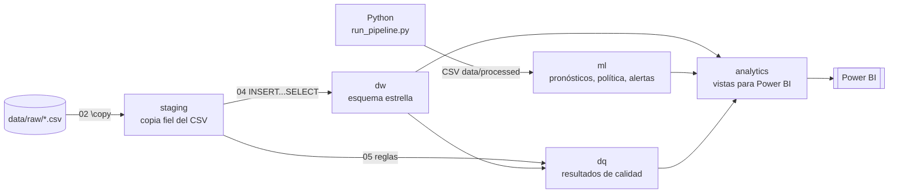
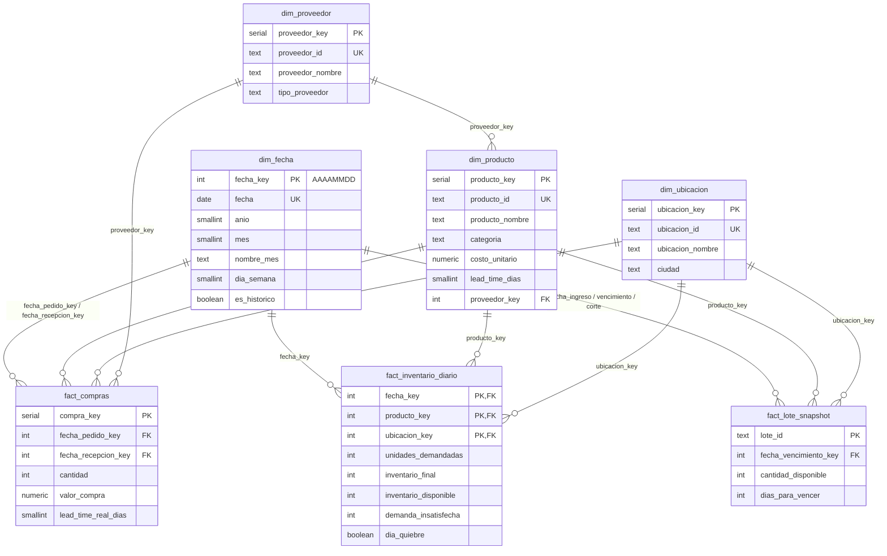

# 03 · Modelo dimensional en PostgreSQL

Scripts: [`sql/`](../sql/) · Carga automática: [`scripts/cargar_postgres.sh`](../scripts/cargar_postgres.sh)

## 1. Arquitectura por capas



| Schema | Propósito | ¿Quién escribe? |
|---|---|---|
| `staging` | Copia 1:1 de los CSV. Se borra y recarga en cada ejecución. | `02_carga_staging.sql` |
| `dw` | Modelo dimensional con llaves, restricciones y medidas derivadas. | `04_transformacion_dw.sql` |
| `dq` | Resultado de cada regla de calidad, con fecha de ejecución (histórico). | `05_validaciones_calidad.sql` |
| `ml` | Salidas del pipeline de Python (pronóstico, métricas, política, alertas). | `06_resultados_ml.sql` |
| `analytics` | Vistas estables con nombres amigables para Power BI. | `07_vistas_analytics.sql` |

Separar en capas permite **reprocesar** una parte sin tocar las demás y deja claro de dónde viene cada dato (linaje).

## 2. ¿Qué es un modelo dimensional (esquema estrella)?

Es la forma estándar de organizar datos para análisis (metodología de Ralph Kimball):

- **Tablas de hechos** en el centro: registran eventos medibles (unidades, valores) a un **grano** definido.
- **Tablas de dimensiones** alrededor: describen el contexto (qué producto, qué sede, qué día).
- Las consultas siempre siguen el mismo patrón: *filtrar por dimensiones, sumar medidas de hechos*.
  Power BI está optimizado exactamente para eso.



## 3. Decisiones de diseño explicadas

### 3.1 Grano de cada hecho
Definir el grano es **el primer paso** de cualquier modelo dimensional. Si el grano no está claro,
aparecen dobles conteos.

| Hecho | Grano | Tipo de hecho |
|---|---|---|
| `fact_inventario_diario` | día × producto × sede | Transaccional/periódico (saldo diario) |
| `fact_compras` | 1 orden de compra | Transaccional con 2 fechas (*accumulating*) |
| `fact_lote_snapshot` | 1 lote a la fecha de corte | *Snapshot* (foto de un momento) |

### 3.2 Consolidar demanda e inventario en un solo hecho
En el origen, `fact_demanda` y `fact_inventario` tienen **exactamente el mismo grano**. Tenerlas
separadas obligaría a Power BI a relacionar 82 mil filas con 82 mil filas en cada visual. Se unen
en `dw.fact_inventario_diario` (y una regla de calidad verifica que no se pierde ninguna fila ni unidad).

### 3.3 Llaves sustitutas (*surrogate keys*)
Las dimensiones tienen una llave entera generada por el DW (`producto_key SERIAL`) además de la
llave de negocio (`producto_id = 'MED-001'`, marcada `UNIQUE`). Ventajas:
- Joins más rápidos (enteros vs. texto).
- El DW no depende de los códigos del sistema fuente (si el ERP cambia el código, no se rompen los hechos).
- Permite versionar dimensiones (SCD tipo 2: si un producto cambia de proveedor, se crea una nueva fila con otra key y el histórico queda intacto).

La excepción es `dim_fecha`, cuya llave es `AAAAMMDD` (ej. `20251231`): es estándar, legible y ordenable.

### 3.4 Dimensión fecha generada, no copiada
`dw.dim_fecha` se genera con `generate_series` de 2023 a 2030 porque los análisis necesitan fechas
**futuras**: pronóstico de enero 2026, recepciones de pedidos en tránsito y vencimientos hasta 2029.
Además se traducen los nombres de mes y día al español y se agrega `es_historico`.
Una regla de calidad verifica que coincide con el `dim_fecha` del origen.

### 3.5 Dimensión con múltiples roles (*role-playing dimension*)
`fact_compras` tiene fecha de pedido y fecha de recepción. Ambas apuntan a la misma `dim_fecha`.
En SQL se une dos veces con alias (`fp`, `fr`); en Power BI se crea una relación activa y otra
inactiva que se activa con `USERELATIONSHIP` en DAX.

### 3.6 Dimensión degenerada
`lote_id` vive en el hecho sin tabla propia: no tiene más atributos que describir. Se llama
dimensión degenerada.

### 3.7 Estrella, no copo de nieve
`dim_producto` guarda la FK al proveedor **y** su nombre desnormalizado. Así Power BI filtra por
proveedor sin saltar dos tablas (un "copo de nieve" es más lento y confuso para el usuario final).

### 3.8 Medidas derivadas calculadas en la carga
`demanda_insatisfecha = max(0, salidas − (inicial + entradas))`, `dia_quiebre` y
`lead_time_real_dias` se calculan **una vez** en el ETL, no en cada reporte.

### 3.9 Restricciones como control de calidad
Ejemplos en `03_modelo_dimensional.sql`:
```sql
CHECK (inventario_disponible = inventario_final - inventario_reservado)
CHECK (valor_compra = cantidad * costo_unitario)
CHECK (fecha_vencimiento_key > fecha_ingreso_key)
```
Si un archivo futuro trae un dato que viola estas reglas, la carga falla y **todo** se revierte
(la transformación corre dentro de `BEGIN ... COMMIT`).

### 3.10 El diccionario vive también en la base
Con `COMMENT ON TABLE/COLUMN` las descripciones quedan dentro de PostgreSQL y las ven DBeaver,
pgAdmin o cualquier catálogo de datos. Consulta de ejemplo:
```sql
SELECT c.table_name, c.column_name, pgd.description
FROM pg_catalog.pg_statio_all_tables st
JOIN pg_catalog.pg_description pgd ON pgd.objoid = st.relid
JOIN information_schema.columns c ON c.table_schema = st.schemaname AND c.table_name = st.relname
                                  AND c.ordinal_position = pgd.objsubid
WHERE c.table_schema = 'dw';
```

## 4. Vistas de consumo (`analytics`)

| Vista | Uso en Power BI |
|---|---|
| `dim_fecha`, `dim_producto`, `dim_ubicacion`, `dim_proveedor` | Dimensiones (filtros y ejes) |
| `fact_inventario_diario` | Cobertura, quiebres, valor del inventario (incluye promedio móvil de 28 días con `AVG() OVER`) |
| `fact_compras` | Lead time real vs. planeado, pedidos en tránsito |
| `v_kpi_mensual`, `v_rotacion_anual` | Rotación y días de inventario precalculados |
| `fact_pronostico_backtest`, `metricas_modelos`, `v_precision_pronostico` | Página de precisión del pronóstico |
| `fact_pronostico_futuro` | Pronóstico de 28 días con intervalo |
| `fact_politica_inventario` | SS, ROP, máximo, cantidad sugerida, estado |
| `fact_lotes`, `fact_alertas` | Riesgo de vencimiento y centro de alertas |
| `calidad_datos` | Página de calidad de datos |

Las vistas exponen las **llaves de negocio** (`producto_id`, `ubicacion_id`, `fecha`), por lo que el
modelo de Power BI es idéntico si se alimenta de PostgreSQL o de los CSV.

## 5. Técnicas de SQL que se practican en los scripts

| Técnica | Dónde |
|---|---|
| `\copy` para cargar CSV | `02_carga_staging.sql` |
| `generate_series`, arreglos, `EXTRACT(ISODOW ...)` | `04_transformacion_dw.sql` (calendario) |
| Transacciones `BEGIN/COMMIT` | `04`, `05` |
| `COUNT(*) FILTER (WHERE ...)` | `05_validaciones_calidad.sql` |
| `CROSS JOIN` + `LEFT JOIN` para encontrar huecos | `05` (panel completo) |
| Funciones de ventana `LAG`, `AVG() OVER`, `ROW_NUMBER` | `05`, `07`, `08` |
| `PERCENTILE_CONT` (IQR, p95) | `05`, `08` |
| Columnas generadas (`GENERATED ALWAYS AS`) | `05` (`dq.resultados.estado`) |
| CTE (`WITH`) | `08_consultas_analiticas.sql` |
