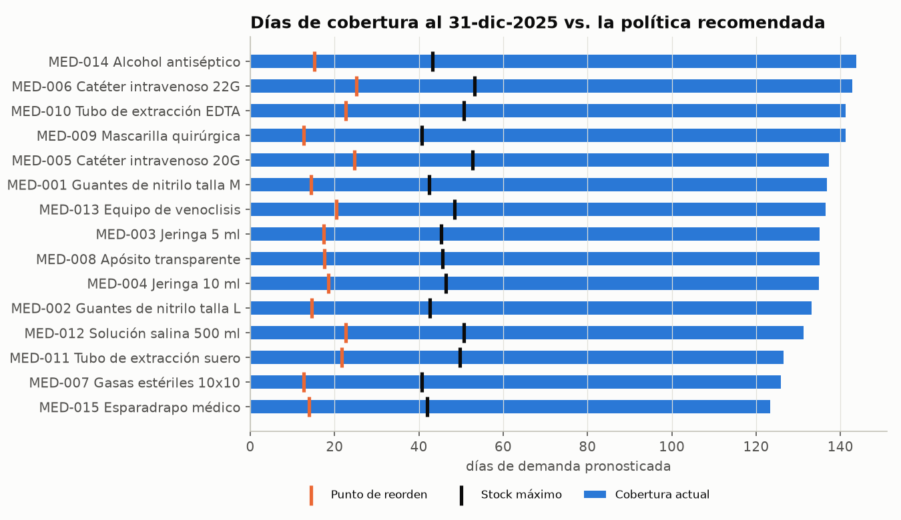
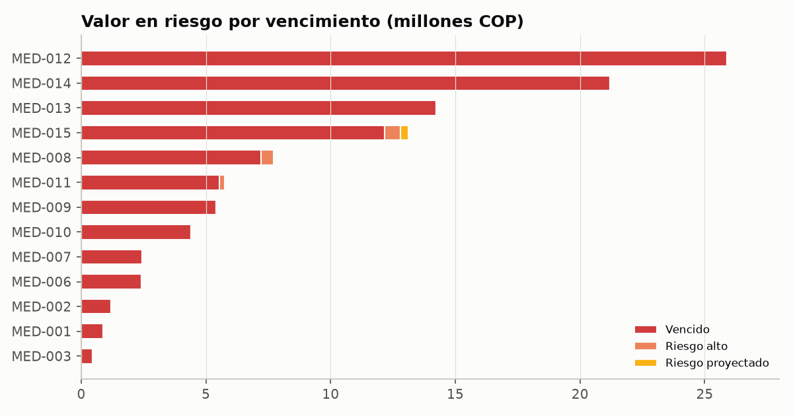

# 06 · Política de inventario y alertas

Código: [`src/healthsupply/inventory_policy.py`](../src/healthsupply/inventory_policy.py) ·
[`src/healthsupply/alerts.py`](../src/healthsupply/alerts.py) ·
Notebook: [`notebooks/03_politica_inventario_y_alertas.ipynb`](../notebooks/03_politica_inventario_y_alertas.ipynb)

## 1. De pronóstico a decisión

Un pronóstico por sí solo no mueve inventario. Hay que traducirlo en tres respuestas:

1. **¿Cuánto colchón necesito?** → stock de seguridad (SS)
2. **¿Cuándo pido?** → punto de reorden (ROP)
3. **¿Cuánto pido?** → hasta el stock máximo (S)

```
 inventario
   ▲
 S ┤\                /\                 ← stock máximo: nivel al que se repone
   │ \              /  \
   │  \            /    \
ROP┤---\----------/------\---------     ← al cruzar el ROP se pide
   │    \  LT    /        \
 SS┤-----\______/----------\-------     ← colchón para la incertidumbre
   │
   └────────────────────────────────▶ tiempo
         pedido  llegada
```

## 2. Clasificación ABC: no todo merece la misma protección

Se ordenan los productos por **valor consumido** en los últimos 12 meses (unidades × costo) y se
acumula el %:

| Clase | Criterio | Nivel de servicio | z |
|---|---|---:|---:|
| A | primer 80 % del valor | 98 % | 2,054 |
| B | 80 % – 95 % | 95 % | 1,645 |
| C | resto | 90 % | 1,282 |

El **nivel de servicio** es la probabilidad de **no** quedarse sin stock durante el tiempo de
reposición. `z` es el valor de la distribución normal estándar que deja ese % a la izquierda
(`NormalDist().inv_cdf(0.95) = 1,645`).

Resultado: 10 productos A, 4 B, 1 C. (Con costos tan parecidos, el valor se reparte; en un hospital
real los medicamentos de alto costo concentran mucho más la curva.)

## 3. Fórmulas

| Símbolo | Significado | Fuente |
|---|---|---|
| d | Demanda diaria esperada | Promedio del pronóstico de 28 días |
| σe | Desviación estándar del **error** diario del pronóstico | Backtest del modelo ganador, por serie |
| LT | Lead time promedio real | `fact_compras` (recepción − pedido) |
| σLT | Desviación del lead time real | `fact_compras` |
| R | Periodo de revisión | 28 días (ritmo de pedidos observado) |

$$SS = z \cdot \sqrt{LT \cdot \sigma_e^2 + d^2 \cdot \sigma_{LT}^2}$$

$$ROP = d \cdot LT + SS \qquad S = d \cdot (LT + R) + SS$$

$$\text{Posición} = \text{disponible} + \text{en tránsito} \qquad \text{Cantidad sugerida} = S - \text{Posición} \;\; (\text{si Posición} \le ROP)$$

### ¿De dónde sale la fórmula del stock de seguridad?
Durante el lead time hay dos fuentes de incertidumbre independientes:
- **Demanda**: cada día el error tiene varianza σe². En LT días, la varianza suma: `LT · σe²`.
- **Lead time**: si el proveedor se demora σLT días de más, se consumen `d · σLT` unidades extra; su varianza es `d² · σLT²`.

Las varianzas independientes se suman; la raíz da la desviación total; `z` la escala al nivel de
servicio deseado.

### ¿Por qué σ del **error** y no σ de la **demanda**?
El stock de seguridad cubre lo que **no sabemos**. Si el modelo ya anticipa que el lunes se vende
más que el domingo, esa variación no es incertidumbre. Usar la desviación de la demanda histórica
sobrestimaría el colchón. Así, **mejor pronóstico → menor σe → menos stock de seguridad**.

### ¿Por qué la posición de inventario y no solo el disponible?
Si ya hay un pedido en camino, pedir de nuevo con base solo en lo disponible duplicaría la compra.
Al 31-dic-2025 hay **75 órdenes en tránsito** que llegan entre el 5 y el 18 de enero.

## 4. Ejemplo resuelto: MED-001 (guantes M) en LOC-001 (Hospital Central)

| Dato | Valor |
|---|---:|
| Clase / nivel de servicio / z | B / 95 % / 1,645 |
| d (pronóstico ene-2026) | 68,92 u/día |
| σe (error RandomForest en backtest) | 9,34 u |
| LT / σLT | 11,85 / 1,50 días |

1. Varianza por demanda: `11,85 × 9,34² = 1.034`
2. Varianza por lead time: `68,92² × 1,50² = 10.635`
3. `SS = 1,645 × √(1.034 + 10.635) = 1,645 × 108,0 = 177,7 → 178 u`
4. `ROP = 68,92 × 11,85 + 178 = 816,7 + 178 → 995 u`
5. `S = 68,92 × (11,85 + 28) + 178 → 2.925 u`
6. Disponible 10.091 u + en tránsito 260 u = posición 10.351 u → **mayor que el ROP → no pedir**.
7. Cobertura = 10.091 / 68,92 = **146 días** → 7.166 u sobre el máximo (≈ $3,2 millones) → **SOBRESTOCK**.

**Lección:** el 91 % de la varianza viene del **lead time**. Mejorar la puntualidad del proveedor
reduce el colchón más que seguir afinando el modelo. Comparando la política completa calculada con
los errores del ML frente a los del mejor modelo base, σe baja ~24 % (4,2 → 3,2 u) pero el stock de
seguridad total solo baja ~3 % (5.873 → 5.714 u) precisamente porque domina el lead time.

## 5. Estados y alertas de inventario

Cada producto × sede recibe **un** estado, evaluado en este orden de prioridad:

| Estado | Condición | Alerta | Severidad | Acción |
|---|---|---|---|---|
| RIESGO_QUIEBRE | disponible ≤ SS | QUIEBRE | CRÍTICA | Pedido urgente / traslado desde otra sede |
| REORDENAR | posición ≤ ROP | REORDEN | ALTA | Emitir pedido por `cantidad_sugerida` |
| SOBRESTOCK | disponible > S | SOBRESTOCK | MEDIA | No pedir; redistribuir; revisar contratos |
| OK | ninguna de las anteriores | — | — | — |

Los umbrales están en `config.py` (`FACTOR_SOBRESTOCK`, `DIAS_ALERTA_VENCIMIENTO`).

## 6. Riesgo de vencimiento con simulación FEFO

**FEFO** (*First Expired, First Out*): en salud se despacha primero lo que vence primero.
Alertar solo por fecha ("vence en menos de 90 días") genera falsas alarmas: un lote que vence en
30 días pero rota 27 unidades/día no está en riesgo. Por eso se **simula el consumo**:

```
Para cada producto × sede, lotes ordenados por vencimiento, consumo d u/día:
  t = 0                                   # día en que se liberan los lotes anteriores
  para cada lote:
     si ya venció -> todo el lote en riesgo
     ventana  = días_para_vencer − t      # tiempo que tiene este lote para rotar
     consumido = min(cantidad, d × ventana)
     en_riesgo = cantidad − consumido
     t = t + consumido / d
```

| Estado | Condición | Severidad |
|---|---|---|
| VENCIDO | ya pasó la fecha de vencimiento | CRÍTICA |
| RIESGO_ALTO | vence en ≤ 90 días y quedarán unidades sin consumir | ALTA |
| RIESGO_PROYECTADO | vence en > 90 días pero igual quedarán unidades | MEDIA |
| VENCE_PRONTO_ROTA_A_TIEMPO | vence en ≤ 90 días pero se consume a tiempo | (sin alerta) |

## 7. Resultados al 31-dic-2025



- **75 de 75 combinaciones en SOBRESTOCK**: cobertura de 100 a 165 días frente a un máximo
  recomendado de ~40-55 días.
- **$193,1 millones COP** por encima del stock máximo (66 % del valor del inventario disponible de $293,5 millones).
- **Cantidad sugerida = 0** en todos los casos: la política recomienda **no emitir pedidos** hasta
  que la posición baje al punto de reorden.



| Estado de lotes | Lotes | Unidades en riesgo | Valor (COP) |
|---|---:|---:|---:|
| VENCIDO | 71 | 53.333 | $103,4 millones |
| RIESGO_ALTO | 3 | 770 | $1,4 millones |
| RIESGO_PROYECTADO | 1 | 126 | $0,3 millones |
| VENCE_PRONTO_ROTA_A_TIEMPO | 6 | 0 | — |
| OK | 144 | 0 | — |

**Total de alertas: 150** (75 de sobrestock + 71 críticas de vencimiento + 3 altas + 1 media).

## 8. Recomendaciones de negocio

1. **Congelar compras** de los 15 insumos hasta que cada serie cruce su punto de reorden
   (en promedio ~4 meses: entre 86 y 156 días según la serie) y usar la política ROP/S en adelante.
2. **Dar de baja los 71 lotes vencidos** ($103 millones) y revisar por qué no se aplicó FEFO.
3. **Trasladar** los 4 lotes en riesgo a sedes con mayor consumo o priorizar su despacho.
4. **Negociar puntualidad con proveedores**: la variabilidad del lead time explica ~90 % del stock
   de seguridad en productos como MED-001.
5. **Operar el ciclo mensual**: correr el pipeline, revisar el centro de alertas en Power BI y
   emitir solo los pedidos sugeridos.
