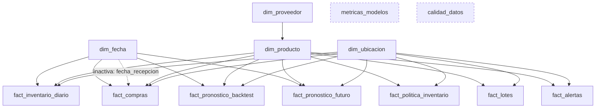

# 07 · Tablero en Power BI: guía de construcción paso a paso

Archivos de apoyo: [`powerbi/medidas_dax.md`](../powerbi/medidas_dax.md) ·
[`powerbi/tema_healthsupply.json`](../powerbi/tema_healthsupply.json)

> Power BI Desktop es gratuito pero solo corre en **Windows**. El archivo `.pbix` es binario, así
> que este repositorio incluye todo lo necesario para construirlo (datos, modelo, medidas, tema y
> diseño de páginas). Al terminarlo, guárdalo como `powerbi/HealthSupply_AI.pbix` y súbelo al repo
> junto con capturas en `reports/figures/powerbi_*.png`.

## 1. Conectar los datos (elige un modo)

### Modo A · PostgreSQL (recomendado, es el flujo "real")
1. Ejecuta `python scripts/run_pipeline.py` y `bash scripts/cargar_postgres.sh`.
2. Power BI → **Obtener datos → Base de datos PostgreSQL**.
   - Servidor: `localhost` · Base de datos: `healthsupply` · Modo: **Importar**.
   - Si pide el proveedor Npgsql, instálalo (Power BI Desktop recientes ya lo incluyen).
3. En el navegador marca las vistas del schema **`analytics`**:
   `dim_fecha`, `dim_producto`, `dim_ubicacion`, `dim_proveedor`, `fact_inventario_diario`,
   `fact_compras`, `fact_pronostico_backtest`, `fact_pronostico_futuro`, `metricas_modelos`,
   `fact_politica_inventario`, `fact_lotes`, `fact_alertas`, `calidad_datos`.
4. En Power Query quita el prefijo `analytics ` de los nombres de las consultas (clic derecho → Cambiar nombre).

### Modo B · Archivos CSV (sin instalar PostgreSQL)
1. Ejecuta `python scripts/run_pipeline.py` y luego `python scripts/exportar_powerbi.py`.
2. Power BI → **Obtener datos → Texto/CSV** y carga cada archivo de `data/powerbi/` (una tabla
   por archivo, con el mismo nombre del archivo).
3. Verifica en Power Query que el origen use **UTF-8** (65001) para que se vean bien las tildes y que
   las columnas de fecha queden con tipo *Fecha*.

Ambos modos producen las **mismas tablas y columnas**, así que el resto de la guía es idéntico.

## 2. Modelo de datos (vista de Modelo)



Pasos:
1. **Marca `dim_fecha` como tabla de fechas** (clic derecho → Marcar como tabla de fechas → columna `fecha`). Esto habilita las funciones de inteligencia de tiempo (`DATESINPERIOD`, etc.).
2. Crea las relaciones **muchos a uno (*:1), dirección de filtro única** desde cada hecho hacia su dimensión:

| Desde (muchos) | Columna | Hacia (uno) | Columna | Activa |
|---|---|---|---|---|
| fact_inventario_diario | fecha / producto_id / ubicacion_id | dim_fecha / dim_producto / dim_ubicacion | fecha / producto_id / ubicacion_id | Sí |
| fact_compras | fecha_pedido | dim_fecha | fecha | Sí |
| fact_compras | fecha_recepcion | dim_fecha | fecha | **No** (se usa con `USERELATIONSHIP`) |
| fact_compras | producto_id / ubicacion_id | dim_producto / dim_ubicacion | producto_id / ubicacion_id | Sí |
| fact_pronostico_backtest | fecha / producto_id / ubicacion_id | dims | ... | Sí |
| fact_pronostico_futuro | fecha / producto_id / ubicacion_id | dims | ... | Sí |
| fact_politica_inventario | producto_id / ubicacion_id | dim_producto / dim_ubicacion | ... | Sí |
| fact_lotes | producto_id / ubicacion_id | dim_producto / dim_ubicacion | ... | Sí |
| fact_alertas | producto_id / ubicacion_id | dim_producto / dim_ubicacion | ... | Sí |
| dim_producto | proveedor_id | dim_proveedor | proveedor_id | Sí |

3. `metricas_modelos` y `calidad_datos` quedan **sin relación** (tablas pequeñas de referencia).
4. Power BI suele crear relaciones automáticas: revísalas y elimina las que no estén en la tabla (en
   especial cualquier relación entre dos hechos).
5. Oculta en la vista de informe las columnas llave de los hechos (`producto_id`, `fecha`...) para
   que el usuario filtre siempre desde las dimensiones.
6. En `dim_fecha` configura **Ordenar por columna**: `nombre_mes` por `mes` y `nombre_dia` por `dia_semana`.

**¿Por qué dirección única?** Con filtros bidireccionales los resultados se vuelven ambiguos y lentos.
En un esquema estrella las dimensiones filtran a los hechos, nunca al revés.

## 3. Medidas y tema

1. Crea las medidas de [`powerbi/medidas_dax.md`](../powerbi/medidas_dax.md) en una tabla `_Medidas`.
2. **Vista → Temas → Buscar temas** → `powerbi/tema_healthsupply.json`. La paleta es apta para
   daltonismo y reserva verde/amarillo/rojo para **estados** (OK/advertencia/crítico).

## 4. Diseño de páginas

Lienzo 16:9. En todas las páginas, una **franja superior de filtros** (segmentadores de
`dim_fecha[anio_mes]`, `dim_producto[categoria]`, `dim_producto[producto_nombre]`,
`dim_ubicacion[ubicacion_nombre]`) sincronizados (Vista → Sincronizar segmentaciones).

### Página 1 · Resumen ejecutivo
```
┌────────────┬────────────┬────────────┬────────────┬────────────┬────────────┐
│ Valor inv. │ Días de    │ Rotación   │ Fill rate  │ Precisión  │ Valor en   │
│ cierre     │ cobertura  │ anualizada │            │ (1 - WAPE) │ riesgo venc│
├────────────┴────────────┴────────────┼────────────┴────────────┴────────────┤
│ Líneas: Días de cobertura por mes    │ Barras: alertas por tipo y severidad │
│ (2023 → 2025: de quiebre a exceso)   │                                      │
├──────────────────────────────────────┴──────────────────────────────────────┤
│ Tabla: top 10 alertas (severidad con ícono, producto, sede, mensaje, valor) │
└─────────────────────────────────────────────────────────────────────────────┘
```
- Tarjetas (*Card* nuevo): medidas `Valor Inventario Cierre`, `Dias de Cobertura`, `Rotacion Anualizada`, `Fill Rate`, `Precision (1 - WAPE)`, `Valor en Riesgo de Vencimiento`.
- Líneas: eje `dim_fecha[anio_mes]`, valor `Dias de Cobertura`. Agrega una **línea de referencia constante** con la cobertura máxima recomendada (~46 días).

### Página 2 · Cobertura e inventario
- **Matriz** producto × sede con `Dias de Cobertura` y **formato condicional** (fondo): rojo < 15 días (riesgo de quiebre), verde 15-55, amarillo > 55 (sobrestock). Los cortes salen de la política: ROP ≈ 15-25 días, máximo ≈ 40-55 días.
- **Barras horizontales** por producto: `Cobertura Actual vs Politica (dias)` con la `Cobertura Maxima Politica (dias)` como marcador de objetivo (visual *Bullet chart* de AppSource o barras + línea).
- **Tabla de reposición**: producto, sede, `Stock de Seguridad (u)`, `Punto de Reorden (u)`, `Stock Maximo (u)`, disponible, en tránsito, `Cantidad Sugerida (u)`, estado (con ícono).
- **Barras**: `Valor en Sobrestock` por sede.

### Página 3 · Rotación y servicio
- **Barras**: `Rotacion Anualizada` por producto (ordenadas) y **columnas** por año para ver la caída 2023 → 2025.
- **Líneas**: `Dias de Inventario (DOH)` por mes.
- **Columnas**: `Dias de Quiebre` y `Demanda Insatisfecha (u)` por producto (solo 2023 tiene quiebres).
- **Dispersión**: eje X `Rotacion Anualizada`, eje Y `Fill Rate`, detalle producto → muestra el equilibrio servicio vs. eficiencia.
- **Tabla de proveedores**: `Lead Time Real Promedio (dias)`, `% Entregas a Tiempo` por `dim_proveedor[proveedor_nombre]`.

### Página 4 · Riesgo de vencimiento
- Tarjetas: `Valor en Riesgo de Vencimiento`, `Lotes Vencidos`, `Lotes en Riesgo (no vencidos)`, `% Valor en Riesgo`.
- **Columnas apiladas**: `valor_disponible` por `fact_lotes[rango_vencimiento]` (orden 1 → 5), leyenda `estado_vencimiento`.
- **Barras**: `Valor en Riesgo de Vencimiento` por producto.
- **Tabla de lotes**: lote, producto, sede, fecha de vencimiento, días para vencer, disponible, unidades en riesgo, estado. Formato condicional por `dias_para_vencer`.

### Página 5 · Precisión del pronóstico
- Tarjetas: `WAPE`, `MAPE`, `MAE`, `Sesgo %` y `Mejora vs Modelo Base`, con segmentador de `fact_pronostico_backtest[modelo]`.
- **Barras** desde `metricas_modelos`: `wape` por `modelo`, color por `tipo_modelo` (azul ML, gris base). *El mismo gráfico del README.*
- **Líneas** (backtest): eje `dim_fecha[fecha]`, valores `Real (u)` y `Pronostico (u)`; filtra un producto y una sede para leerlo.
- **Matriz**: filas producto, columnas modelo, valor `WAPE` con escala de color (tema: mínimo azul claro → máximo azul oscuro).
- **Columnas**: `WAPE` por `fold` y modelo → estabilidad en el tiempo.
- **Líneas del pronóstico futuro**: eje `dim_fecha[fecha]` (enero 2026), `Pronostico Futuro (u)` con `Pronostico Limite Inferior/Superior (u)` como banda (panel Análisis → *Error bars* o dos líneas punteadas).

### Página 6 · Centro de alertas
- Segmentadores: `tipo_alerta`, `severidad`.
- **Tabla**: `orden_severidad` (oculta, para ordenar), severidad con **íconos** (formato condicional → Íconos: CRITICA = rojo, ALTA = naranja, MEDIA = amarillo), tipo, producto, sede, lote, unidades, valor, mensaje.
- **Treemap**: `valor` por `tipo_alerta` → `producto_nombre`.

### Página 7 · Calidad de datos
- Tarjetas: `Reglas Evaluadas`, `% Reglas OK`.
- **Tabla**: tabla, regla, dimensión, estado (ícono), registros evaluados, fallidos, % fallidos.
- **Barras apiladas**: reglas por `dimension` y `estado`.

## 5. Buenas prácticas aplicadas

- **Una idea por visual** y títulos que responden la pregunta ("¿Dónde sobra inventario?").
- **Nunca doble eje Y**: si dos medidas tienen escalas distintas, dos gráficos.
- **Color con significado**: azul = dato; gris = referencia/modelo base; verde/amarillo/rojo solo para estados, siempre acompañados de ícono o etiqueta (accesibilidad).
- **Tooltips** personalizados (página de información sobre herramientas) con el detalle de la política por producto.
- **Rendimiento**: modo Importar, relaciones 1:* con dirección única, medidas en vez de columnas calculadas cuando dependen de filtros.
- **Actualización**: tras cada corrida del pipeline, *Inicio → Actualizar*. Con Power BI Service + gateway se puede programar.

## 6. Checklist de verificación (compara con los resultados del pipeline)

| Medida | Filtro | Valor esperado |
|---|---|---|
| `WAPE` | modelo = RandomForest | 10,9 % |
| `WAPE` | modelo = promedio_dia_semana_8s | 14,4 % |
| `Mejora vs Modelo Base` | sin filtro | 24,6 % |
| `Valor en Sobrestock` | sin filtro | $193,1 millones |
| `Valor en Riesgo de Vencimiento` | sin filtro | $105,1 millones |
| `Lotes Vencidos` | sin filtro | 71 |
| `Dias de Quiebre` | año 2023 | 46 |
| `Alertas` | sin filtro | 150 |

Si algún valor no coincide, revisa relaciones (dirección y columnas) y que `dim_fecha` esté marcada como tabla de fechas.
